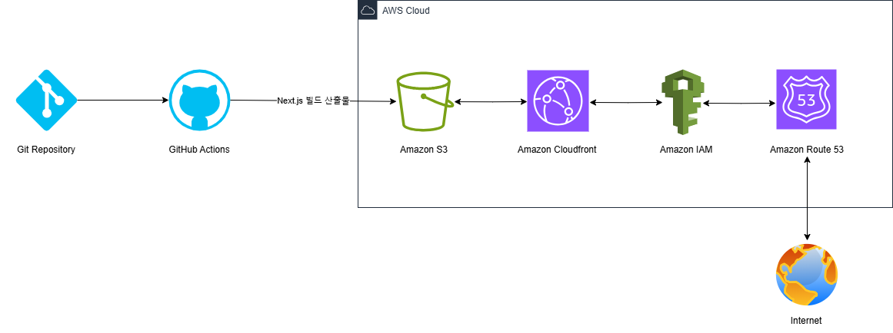

# 배포 파이프라인 구축 가이드

## 목차

1. [소개](#소개)
2. [파이프라인 구축 효과](#파이프라인-구축-효과)
3. [사전 준비](#사전-준비)
4. [세팅 절차](#세팅-절차)
5. [주요 링크](#주요-링크)
6. [주요 개념](#주요-개념)
7. [CDN을 이용한 최적화 보고서](#cdn을-이용한-최적화-보고서)

## 소개

1. 저장소를 체크아웃.
2. Node.js 18.x 버전을 설정.
3. 프로젝트 의존성을 설치.
4. Next.js 프로젝트를 빌드.
5. AWS 자격 증명을 구성.
6. 빌드된 파일을 S3 버킷에 동기화.
7. CloudFront 캐시를 무효화.
8. Route 53 DNS 서비스 구축
9. 사용자에게 오픈.

## 파이프라인 구축 효과

- 자동화 : GitHub Actions는 빌드 및 배포 프로세스를 자동화.
- 확장성 : S3 및 CloudFront를 이용하여 트래픽 증가 시 별도의 수고 없이 자동으로 트래픽을 확장 가능.
- 성능 : CloudFront의 CDN(Content Delivery Network)을 통해 뛰어난 최적화 성능을 제공.
- 보안 : IAM은 세분화된 액세스 제어를 제공하여 승인된 사용자만 AWS 리소스와 상호 작용할 수 있도록 도와 주어 강력한 보안 제공.
- 투명성 : GitHub Actions, S3 및 CloudFront는 배포 프로세스에 대한 명확한 가시성을 제공하여 협업이 더욱 투명.

## 사전 준비

- 링크를 클릭해서 설치 페이지로 이동

1. [Visual Studio Code 설치](https://code.visualstudio.com/)
2. [Node.js 설치 (18 이상)](https://nodejs.org/en)
3. [AWS 계정 생성](https://aws.amazon.com/s3/)

## 세팅 절차

1. Next.js 설치

- Visual Studio Code 실행 -> New Terminal -> npx create-next-app@latest my-app 입력

2. Git Repository 생성
3. Amazon S3 세팅 / 참고 : https://sprout-log-68d.notion.site/S3-78342f718c3d48b4bda57a11a00ddbf0
4. Amazon Cloudfront 세팅 / 참고 : https://sprout-log-68d.notion.site/CloudFront-2c0653cb130f42b2b21078389511cca2
5. Amazon IAM 세팅 / 참고 : https://sprout-log-68d.notion.site/IAM-87095b5e6ddb4d1990bac9e669cb73f3
6. GitHub Actions

   #### GitHub 저장소 -> Settings > Secrets and variables > Actions -> New repository secret을 클릭해 밑의 내용을 하나 씩 추가

- AWS_ACCESS_KEY_ID : AWS IAM 사용자의 액세스 키 ID
- AWS_SECRET_ACCESS_KEY : AWS IAM 사용자의 시크릿 액세스 키
- AWS_REGION : AWS 리전 (예: ap-northeast-2)
- S3_BUCKET_NAME : 정적 웹사이트 호스팅용 S3 버킷 이름
- CLOUDFRONT_DISTRIBUTION_ID : CloudFront 배포 ID

7. GitHub Actions workflows 확인

   #### GitHub 저장소 -> Actions 화면에서 All workflows들이 정상적으로 성공되는지 확인(실패 시 6번 세팅 다시 확인)

8. Amazon Route 53 세팅 / 참고 : https://inpa.tistory.com/entry/AWS-%F0%9F%93%9A-Route-53-%EA%B0%9C%EB%85%90-%EC%9B%90%EB%A6%AC-%EC%82%AC%EC%9A%A9-%EC%84%B8%ED%8C%85-%F0%9F%92%AF-%EC%A0%95%EB%A6%AC

9. 세팅된 도메인 접속 확인 -> 실패 시 8번 세팅 다시 확인

## 주요 링크

- S3 버킷 웹사이트 엔드포인트 : http://jdj-aws-bucket.s3-website-ap-southeast-2.amazonaws.com/
- CloudFrount 배포 도메인 이름 : https://d2hnnj815xakwr.cloudfront.net

## 주요 개념

- GitHub Actions과 CI/CD 도구
  ##### GitHub Actons
  - GitHub Actions는 GitHub에 내장되어 있어 별도의 플랫폼 없이 GitHub 내에서 직접 워크플로를 쉽게 자동화할 수 있다.
  - AWS, Docker, Kubernetes 등과 같은 다른 도구 및 서비스와 쉽게 통합되어 간편하게 사용할 수 있다.
- ##### CI/CD 도구

  - GitHub Actions와 같은 CI/CD 도구는 코드 변경 사항을 통합, 테스트 및 배포하는 프로세스를 자동화하여 더 빠르고 안정적인 소프트웨어 제공을 보장.
  - 워크플로를 간소화하고 오류를 줄이며 개발 시 지속적인 업데이트를 가능하게 한다.

- S3와 스토리지

  ##### S3(Amazon Simple Storage Service):

  - Amazon S3는 확장성과 내구성이 뛰어난 객체 스토리지 서비스로, 원하는 양의 데이터를 저장하고 검색할 수 있다.
  - 웹 애플리케이션용 이미지, 비디오, CSS, JavaScript 및 웹사이트 파일과 같은 정적 파일을 저장한다.
  - Amazon EMR 또는 Athena와 같은 다른 AWS 서비스에서 분석하고 처리할 수 있도록 방대한 양의 구조화되지 않은 데이터를 저장하는 데이터 레이크 역할을 한다.
  - 수동 개입 없이 대량의 데이터를 처리할 수 있는 동적 확장을 지원한다.

  ##### 스토리지

  - 스토리지는 데이터를 시스템에 저장하고 관리하는 과정이다.
  - 클라우드 컴퓨팅에서 Amazon S3와 같은 서비스는 물리적 하드웨어 없이도 대량의 데이터를 처리할 수 있는 확장 가능하고 안전한 스토리지 솔루션을 제공한다.
  - S3와 같은 클라우드 스토리지 솔루션은 액세스 용이성, 저렴한 비용 및 다른 서비스와의 통합으로 인해 일반적으로 웹 애플리케이션, 백업 및 미디어 스토리지에 사용된다.

- CloudFront와 CDN

  ##### CloudFront

  - Amazon CloudFront는 전 세계 사용자에게 데이터, 비디오, 애플리케이션 및 API를 안전하고 효율적으로 제공하도록 설계된 콘텐츠 전송 네트워크(CDN) 서비스.
  - 최종 사용자와 가까운 엣지 위치에 콘텐츠를 캐싱하여 대기 시간을 줄여 더 빠른 액세스를 보장.
  - CloudFront는 S3, EC2, Route 53 등의 AWS 서비스와 원활하게 통합되어 강력하고 확장 가능한 콘텐츠 전송 솔루션.
  - DDoS 공격으로부터 보호하기 위해 HTTPS 및 AWS Shield와 같은 고급 보안 기능을 지원.

  ##### CDN(Content Delivery Network)

  - CDN은 콘텐츠를 사용자에게 더 가까이 캐시하여 콘텐츠 전달을 가속화하는 전 세계적으로 분산된 서버 네트워크.
  - 데이터가 이동해야 하는 물리적 거리를 줄임으로써 CDN은 대기 시간을 줄이고 웹 사이트 및 애플리케이션의 로드 시간을 향상시킨다.
  - 이미지, 비디오, 스크립트와 같은 정적 자산은 물론 개인화된 페이지와 같은 동적 콘텐츠를 제공하는 데 특히 효과적이다.
  - CDN은 또한 원본 서버에서 에지 서버로 트래픽을 오프로드하여 안정성과 확장성을 향상시킨다.

- 캐시 무효화(Cache Invalidation)

  - 캐시 무효화는 최종 사용자가 최신 버전의 파일 또는 리소스를 받을 수 있도록 CDN(콘텐츠 전송 네트워크)에 저장된 캐시된 콘텐츠를 지우거나 업데이트하는 프로세스이다.
  - 캐시 무효화를 사용하면 TTL(캐시 만료 기간)이 경과할 때까지 기다리지 않고 엣지 로케이션에서 오래된 파일을 제거할 수 있다.
  - 캐시 무효화 사용으로 사용자는 항상 최신 콘텐츠에 엑세스할 수 있게 보장되고, 실시간 업데이트 제공으로 안정성이 향상된다.
  - 캐시 무효화를 사용하면 사용자가 오래되거나 오래된 데이터를 볼 위험이 줄어든다.
  - 위 Amazon Cloudfront 세팅에서 deployment.yml을 작성하는 부분이 있는데 코드의 aws cloudfront create-invalidation 이 명령어가 명시적으로 캐시를 무효화하는 부분이다. 이 명령어로 인해 사용자는 지연 없이 최신 업데이트를 제공 받을 수 있다.

  ##### 캐시 무효화 동작 원리

  - 업데이트 후 실행

    - 웹 사이트 또는 애플리케이션 파일을 배포하거나 업데이트한 후에 명시적으로 트리거된다. 이렇게 하면 엣지 로케이션에 캐시된 오래된 콘텐츠가 최신 버전으로 대체된다.

  - 파이프라인의 명시적 명령

    - CI/CD 파이프라인(예: deployment.yml)에서 aws cloudfront create-invalidation 명령은 배포 후 단계의 일부로 포함된다. 이러면 이전 콘텐츠를 명시적으로 무효화하여 이전 버전에 더 이상 액세스할 수 없도록 한다.

  - 실시간 캐시 무효화 효과
    - 캐시 무효화 명령이 실행되면 해당 사이트에 접속하는 사용자는 업데이트된 콘텐츠를 즉시 받게 된다. 그러면 캐시의 TTL(Time-To-Live)이 만료될 때까지 기다릴 필요없이 우회하여 오래된 캐시 항목을 실시간으로 효과적으로 무효화된다.

- Repository secret과 환경변수

  ##### Repository secret

  - Repository secret는 CI/CD 파이프라인(GitHub Actions 등)에서 사용되어 중요한 정보(예: API 키, 자격 증명)를 안전하게 저장한다.
  - Repository secret은 암호화되어 코드에 민감한 데이터를 노출시키지 않고 빌드 또는 배포 프로세스를 구성하는 데 사용할 수 있다.

  ##### 환경변수

  - 환경 변수는 일반적으로 빌드 또는 배포 중에 액세스할 수 있는 구성 설정을 저장하는 데 사용된다.

## CDN을 이용한 최적화 보고서

- [CDN을 이용한 최적화 보고서](./cdn-comparison-report.md)
