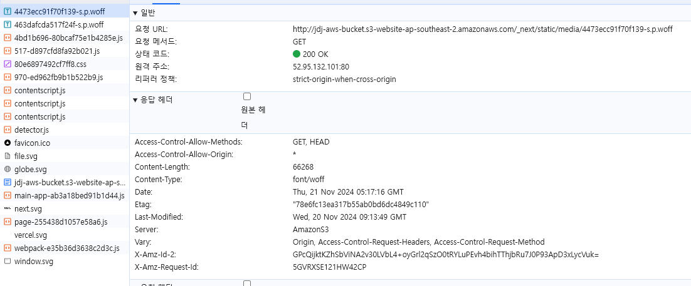
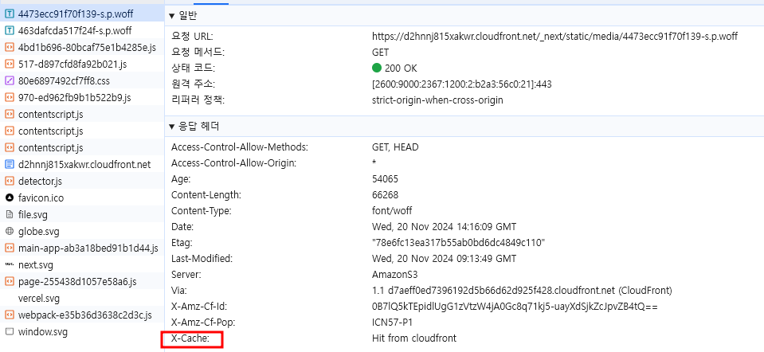

# CDN을 이용한 최적화 보고서

## 목차

- [CDN으로 최적화를 진행한 이유](#cdn으로-최적화를-진행한-이유)
- [테스트 환경](#테스트-환경)
- [테스트](#테스트)
- [S3와 CDN 성능 비교](#s3와-cdn-성능-비교)
- [결론](#결론)

## CDN으로 최적화를 진행한 이유

- S3는 전송 가속화 및 구성 가능한 스토리지 클래스와 같은 일부 성능 및 최적화 기능을 제공하지만 주로 콘텐츠 전달보다는 확장 가능한 객체 스토리지를 위해 설계.
- CDN은 사용자와 가까운 곳(Edge Location)에서 콘텐츠를 캐싱하기 때문에 지연 시간을 줄이고, 로드 시간을 개선하여 웹 애플리케이션에 대한 정적 콘텐츠 최적화를 제공.
- CDN에서 제공하는 최적화 기능으로 S3 단일 사용 보다 CDN을 함께 사용하는 게 웹 애플리케이션 배포 시에 성능이 더 뛰어날 것으로 판단하여 최적화 진행.

## 테스트 환경

### 테스트 URLS

- S3 : http://jdj-aws-bucket.s3-website-ap-southeast-2.amazonaws.com/
- CloudFrount : https://d2hnnj815xakwr.cloudfront.net

### 테스트 방법

- 크롬 브라우저 개발자 도구 네트워크 속도 측정

## 테스트

### 테스트 후 차이점

#### X-Cache

- S3
  

- CDN
  

  - S3에서는 X-Cache가 없지만 CDN에서는 X-Cache 부분이 있는 것으로 확인되면서 캐시가 동작하고 있다는 걸 확인할 수 있다.

#### bucket과 Cloudfront

- S3 : S3에서 사용되는 bucket으로 bucket.s3 노출

  - 

- CDN : CDN이 Cloudfront의 서비스이기 때문에 Cloudfront가 노출

  - 

##### 헤더의 X-Cache와 네트워크에서 조회되는 이름만으로도 어떤 것으로 배포되는지 확인 가능

## S3와 CDN 성능 비교

- S3 네트워크

- CDN 네트워크

- 전송된 데이터 : 다운로드된 데이터의 총 크기.
- 페이지 완료 시간 : 리소스가 페이지에 완전히 로드되고 렌더링되는 데 걸리는 총 시간.
- DOMContentLoaded : 스타일시트, 이미지 및 하위 프레임 로드가 완료될 때까지 기다리지 않고 HTML 문서가 완전히 로드되고 구문 분석되는 데 걸리는 시간.
- 페이지 로드 : 이미지 및 스타일시트와 같은 모든 리소스를 포함하여 페이지를 완전히 로드하는 데 걸리는 총 시간

|           | 전송된 데이터 | 페이지 완료 시간 | DOMContentLoaded | 페이지 로드 |
| --------- | ------------- | ---------------- | ---------------- | ----------- |
| S3        | 572 KB        | 1.85초           | 0.719초          | 1.63초      |
| CDN       | 290 KB        | 0.705초          | 0.246초          | 0.662초     |
| 개선율(%) | 49.30         | 61.89            | 65.78            | 59.38       |

## 결론

- 성능 비교에서 본 결과로 봤을 때 CDN을 사용한 성능이 매우 뛰어남.
- 복잡하지 않고 간단한 설정으로 최적화가 가능하기 때문에 CDN 최적화는 반드시 필요하다고 판단.
